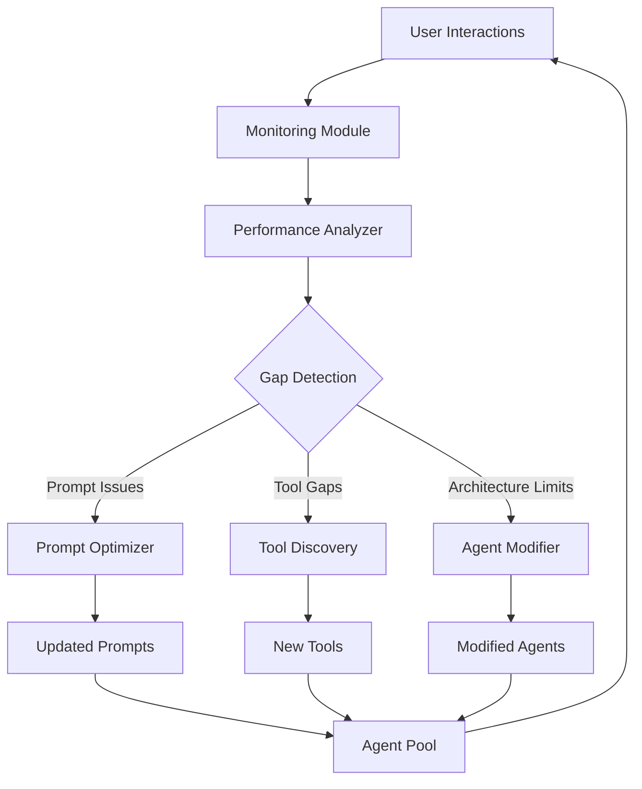

# Agent Framework Comparison (Revised)

## Core Agent Framework Definition
A toolkit for building autonomous AI agents that can:
- Maintain conversation state
- Make context-aware decisions
- Integrate external tools/APIs
- Preserve/process context
- Handle security/auth
- Scale agent deployments

## Focused Framework List

1. **OpenAI Agents SDK**
   - Native OpenAI integration
   - Built-in tool management
   - Excellent MCP support

2. **LangChain**
   - Open-source
   - Flexible tool chaining
   - Strong context management

3. **Microsoft Semantic Kernel**
   - Enterprise-grade
   - Strong security patterns
   - Azure integration

4. **Cohere Coral**
   - Conversation-first
   - Built-in safety controls
   - Limited tool integration

5. **Anthropic Claude API**
   - Constitutional AI
   - Strong ethics controls
   - Basic tool integration

## Self-Learning Approaches

### Architectural Components for Adaptive Systems

### Implementation Options
1. **LangChain + Custom Layer** (Recommended)
   - Add monitoring hooks to existing agents
   - Implement analyzer with GPT-4 evaluation
   - Build safety-constrained modifier

2. **Research Prototypes**:
   - AutoGPT (Unstable)
   - BabyAGI (Limited)
   - Microsoft AutoGen (Early Stage)

3. **Enterprise Solutions**:
   - IBM Watson AutoAI
   - Google Vertex AI Agent Builder

## Key Feature Comparison

| Feature                | OpenAI SDK | LangChain | Semantic Kernel | Coral | Claude |
|------------------------|------------|-----------|-----------------|-------|--------|
| Native OpenAI Support  | ✅ Built-in | 🔌 Plugin | 🔌 Plugin       | ❌     | ❌      |
| MCP Compatibility      | ✅ Full     | ✅ Partial | ✅ Partial       | ❌     | ❌      |
| Tool Integration       | ✅ 50+     | ✅ 100+   | ✅ 30+          | ✅ 10+ | ✅ 5+   |
| Context Window         | 128k       | Unlimited | 64k             | 32k   | 100k   |
| Security Patterns      | ✅✅        | ✅         | ✅✅✅           | ✅     | ✅✅     |
| Conversation State     | ✅ Auto     | ✅ Manual  | ✅ Manual        | ✅ Auto| ❌      |
| Deployment Options     | ✅✅✅       | ✅✅        | ✅✅✅           | ✅     | ✅      |
| Self-Learning Capacity | ❌         | 🔶 Partial | ❌             | ❌     | ❌      |

## Recommendation Breakdown

### For Your Chat App Needs:
1. **OpenAI Agents SDK** - Best for:
   - Direct OpenAI integration
   - MCP compliance
   - Automated context handling
   - Production-ready security

2. **LangChain** - Consider if:
   - Need maximum tool flexibility
   - Require open-source
   - Will customize agent logic

3. **Semantic Kernel** - Consider if:
   - Enterprise security needed
   - Using Azure ecosystem
   - Heavy compliance needs

Would you like me to proceed with updating the phase designs for one of these options?