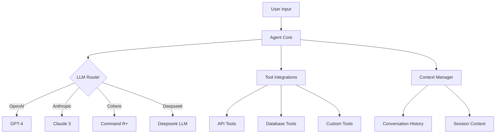
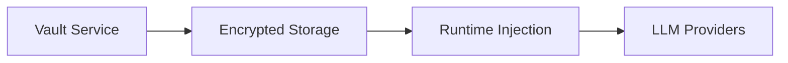

# Revised Multi-LLM Strategy Analysis

## Core Architecture Changes



## Implementation Plan

### 1. Abstract LLM Layer Implementation
```python
from abc import ABC, abstractmethod
from typing import Dict, Any

class LLMProvider(ABC):
    @abstractmethod
    def generate(self, prompt: str, **kwargs) -> str:
        pass

class OpenAIProvider(LLMProvider):
    def __init__(self, api_key: str):
        self.client = OpenAI(api_key=api_key)
        
    def generate(self, prompt: str, **kwargs) -> str:
        response = self.client.chat.completions.create(
            model=kwargs.get('model', 'gpt-4'),
            messages=[{"role": "user", "content": prompt}]
        )
        return response.choices[0].message.content

class AnthropicProvider(LLMProvider):
    def __init__(self, api_key: str):
        self.client = Anthropic(api_key=api_key)
        
    def generate(self, prompt: str, **kwargs) -> str:
        response = self.client.messages.create(
            model=kwargs.get('model', 'claude-3-opus'),
            max_tokens=kwargs.get('max_tokens', 1000),
            messages=[{"role": "user", "content": prompt}]
        )
        return response.content[0].text

class LLMRouter:
    def __init__(self, config: Dict[str, Any]):
        self.providers = {
            'openai': OpenAIProvider(config['OPENAI_API_KEY']),
            'anthropic': AnthropicProvider(config['ANTHROPIC_API_KEY'])
        }
        
    def get_provider(self, provider_name: str) -> LLMProvider:
        return self.providers[provider_name.lower()]
```

### 2. Configuration Changes
```env
# .env
DEFAULT_LLM=openai
OPENAI_API_KEY=sk-...
ANTHROPIC_API_KEY=sk-ant-...
COHERE_API_KEY=...
DEEPSEEK_API_KEY=...
MAX_TOKENS=1000
LLM_TIMEOUT=30
```

### 3. Phase Modifications

**Phase 1 (CLI MVP) Updates**:
- Add provider selection flag: `--provider anthropic`
- Update error handling for multi-LLM
- Implement configuration loader
- Add provider health checks

**Phase 2 (Web Interface) Updates**:
- Add provider selection UI dropdown
- Modify API endpoints to accept provider parameter
- Implement rate limiting per provider
- Add provider status monitoring

**Phase 3 (Containerization) Updates**:
- Add multi-LLM dependency management
- Update secrets handling for multiple API keys
- Implement provider-specific health checks
- Add load balancing configuration

**Phase 4 (Advanced Features) Updates**:
- Add LLM performance monitoring dashboard
- Implement cost tracking per provider
- Add automatic failover between providers
- Implement quality-of-service metrics

## Migration Steps

1. Implement abstraction layer in core module
2. Update configuration system to handle multiple providers
3. Modify existing integrations to use router pattern
4. Add new provider implementations (Cohere, Deepseek)
5. Update documentation with multi-LLM instructions
6. Implement testing framework for provider parity
7. Add monitoring for provider usage metrics
8. Update deployment scripts for multi-provider support

## Security Considerations

1. API Key Management:


2. Access Control:
- Role-based provider access
- Usage quotas per team/user
- Audit logging for provider usage

Would you like me to implement these changes in the phase design documents?