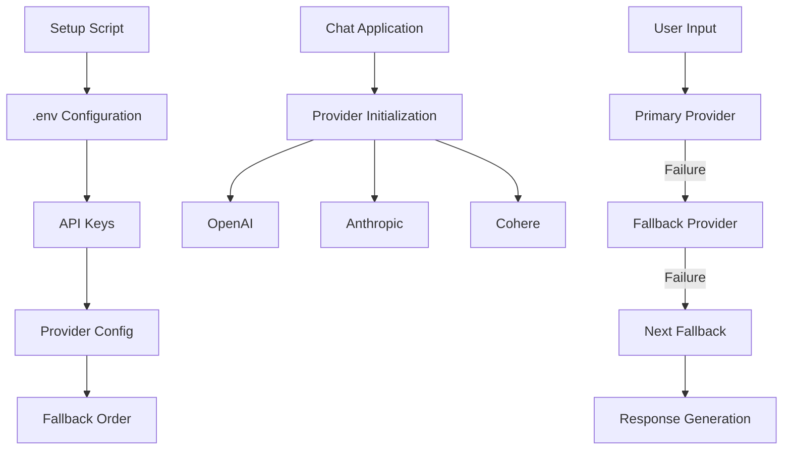

# Phase 1 Setup Script Design - Final Implementation

## Overview
The setup script handles API key configuration for core LLM providers:
- OpenAI
- Anthropic
- Cohere

Key features:
1. Prompts for API keys only when needed
2. Maintains existing valid keys
3. Supports fallback provider ordering
4. Filters out providers without valid keys
5. Provides clear setup instructions
6. Includes troubleshooting guidance
7. Python environment verification and setup
8. Automatic dependency installation
9. Virtual environment management
10. Version compatibility checks

## System Architecture



## Setup Flow

1. Check for existing .env file
   - If exists, validate current configuration
   - Preserve all valid API keys and settings
   - Identify missing or invalid configurations

2. Prompt for missing API keys
   - Only request keys for providers without valid configuration
   - Validate key format before accepting
   - Provide option to skip provider configuration

3. Configure default provider and fallback order
   - Use existing configuration if valid
   - Prompt for changes only if needed
   - Validate provider availability

4. Initialize virtual environment
   - Verify Python version
   - Create virtual environment if needed
   - Install required packages
   - Validate environment setup

5. Install required packages
   - Check for existing installations
   - Only install missing dependencies
   - Verify package versions
   - Handle dependency conflicts

6. Verify installation
   - Test provider connections
   - Validate configuration
   - Generate summary report

### .env File Handling
- Never overwrite existing valid configuration
- Preserve all valid keys and settings
- Only modify missing or invalid entries
- Create backup before making changes
- Provide detailed change summary

## Environment Management

### Python Requirements
- Minimum Python version: 3.9
- Verify Python installation using `python --version`
- Create virtual environment if needed

### Requirements File Management
- All dependencies are managed through requirements.txt
- The setup script should only verify that:
  1. Python version meets requirements
  2. All packages in requirements.txt are installed
- Core dependencies include:
  - LLM provider SDKs
  - LangChain framework
  - Environment management tools
- Installation process:
  1. Create virtual environment
  2. Run `pip install -r requirements.txt`
  3. Verify successful installation
- Development dependencies should be maintained in a separate requirements-dev.txt
- The setup script must not modify or manage requirements.txt content

## Key Features
1. Supports core LLM providers with fallback mechanism
2. Automatic environment configuration
3. Virtual environment setup
4. Package dependency management
5. Configuration validation
6. Safe .env file handling
7. Python environment verification
8. Dependency management
9. Version compatibility checks

## Security Implementation

### Environment File Security
- Set file permissions to 600 (rw-------) for .env
- Ensure .env is included in .gitignore
- Provide .env.example with placeholder values
- Validate file ownership during setup
- Verify file permissions during script execution

### API Key Handling
- Validate API key formats using regex patterns:
  - OpenAI: `sk-[a-zA-Z0-9]{24}`
  - Anthropic: `sk-ant-[a-zA-Z0-9]{32}`
  - Cohere: `[a-zA-Z0-9]{40}`
- Store API keys in environment variables
- Never log or display raw API keys
- Implement secure key rotation reminders
- Mask API keys in all output and logs

### Input Validation
- Validate all user-provided configuration values
- Sanitize input to prevent injection attacks
- Implement basic rate limiting for API calls
- Validate provider URLs and endpoints
- Verify numeric values within acceptable ranges

### Error Handling
- Use generic error messages for authentication failures
- Implement secure logging practices
- Avoid exposing sensitive information in error messages
- Include error codes for troubleshooting
- Provide recovery suggestions for common errors

### Access Control
- Restrict configuration file access to necessary processes
- Validate file ownership and permissions during setup
- Implement basic process isolation
- Verify system user permissions
- Ensure proper directory permissions for log files

### Debug Mode Security
- Enabled only via command line flag
- Automatically disabled after 1 hour of inactivity
- Debug logs stored separately from production logs
- API keys always masked in debug output
- Debug mode disabled by default in production

## Configuration Management

### .env Format
```plaintext
OPENAI_API_KEY=your_openai_key
ANTHROPIC_API_KEY=your_anthropic_key
COHERE_API_KEY=your_cohere_key
DEFAULT_PROVIDER=openai
FALLBACK_ORDER=openai,anthropic,cohere
```

### Essential Settings
- API keys for core providers
- Default provider selection
- Fallback order
- Timeout settings
- Retry limits

## User Guidance

### Setup Instructions
1. Run setup script: `./scripts/phase1_setup.sh`
2. Follow prompts to enter API keys
3. Configure default provider
4. Set fallback order
5. Verify installation

### Troubleshooting
- Invalid API key format
- Provider connection issues
- Configuration validation errors
- Environment setup problems

### Error Recovery
- Clear invalid configuration
- Re-run setup script
- Check network connectivity
- Verify API key permissions

## Implementation Details
- Providers are initialized only when valid API keys are present
- Fallback order is configurable via .env
- Each provider has configurable model and token limits
- Conversation history is maintained using LangChain memory
- Error handling for provider initialization failures

## Logging Configuration
```yaml
logging:
  level: INFO
  file: /var/log/chat_app.log
  rotation:
    size: 100MB
    retention: 7d
  debug:
    enabled: false
    retention: 24h
    file: /var/log/chat_app_debug.log
```

## Testing Strategy
1. Unit tests for configuration validation
2. Integration tests for provider initialization
3. End-to-end tests for fallback behavior
4. Security tests for API key masking
5. Performance tests for timeout handling

## Documentation Standards
- Inline documentation for all configuration options
- Example configurations for each provider
- Security best practices guide
- Troubleshooting guide for common issues
